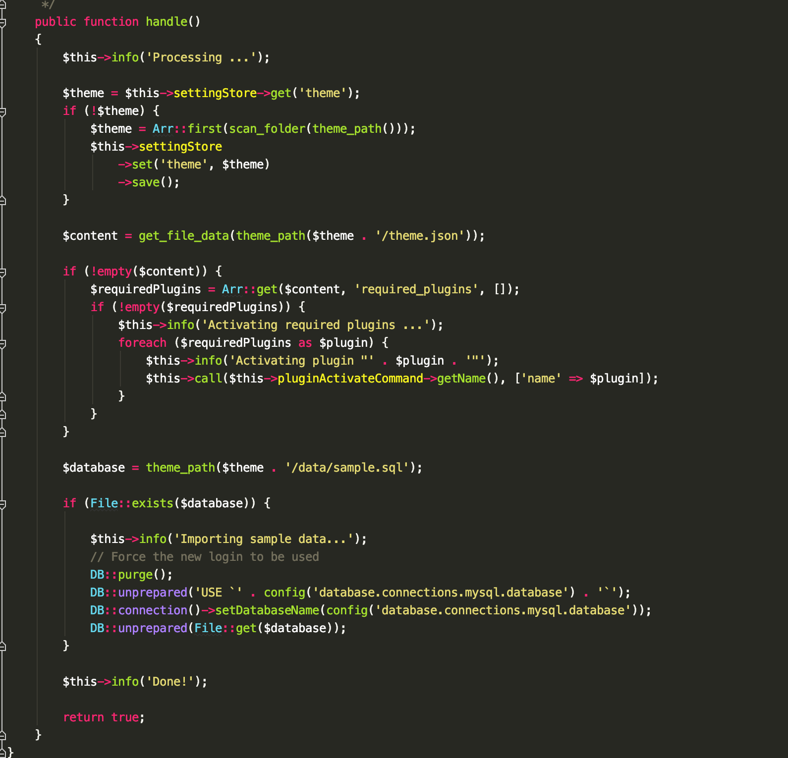
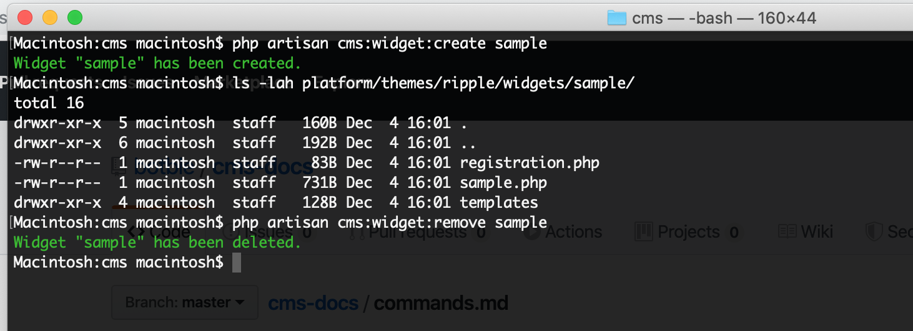

# Commands

- [CMS Install](#install)
- [Create admin user](#create-admin-user)
- [Publish assets](#publish-assets)
- [Create a package](#create-package)
- [Create a plugin](#create-plugin)
- [Activate a plugin](#activate-plugin)
- [Deactivate a plugin](#deactivate-plugin)
- [Remove a plugin](#remove-plugin)
- [Theme commands](#theme-commands)
- [Widget commands](#widget-commands)
    
List of commands are used in Laravel CMS

<a name="install"></a>
## CMS Install
It's used to install CMS.

```
php artisan cms:install
```

Ex:


<a name="create-admin-user"></a>
## Create admin user
It's used to create an admin user.
```
php artisan cms:user:create
```

Ex:


Then you can go to `/admin` and login using account `johnsmith` - `12345678`

## Publish assets
By default, CMS assets is located in `/platform` so to make it accessible we have to copy it into `/public/vendor/core`.
To do that, we need to run command:

```
php artisan vendor:publish --tag=cms-public --force
```

Ex: 


<a name="create-package"></a>
## Create a package
It's used to create a package. The package created will be located in `/platform/packages`

```
php artisan cms:package:create <package>
```

Ex:


Package isn't loaded after created. You need to add it into composer.json and run `composer update` to add it.

<a name="create-plugin"></a>
## Create a plugin
It's used to create a plugin. The plugin created will be located in `/platform/plugins`

```
php artisan cms:plugin:create <plugin>
```

Ex:


<a name="activate-plugin"></a>
## Activate a plugin
Activate an existed plugin.

```
php artisan cms:plugin:activate <plugin>
```

Ex:


That command will add that plugin into list activated plugin in table `settings`, run migrate to update database and clear cache.

<a name="deactivate-plugin"></a>
## Deactivate a plugin
Deactivate an existed plugin.

```
php artisan cms:plugin:deactivate <plugin>
```

Ex:


That command will remove that plugin from list activated plugin in table `settings` so that plugin won't be loaded and clear cache.

<a name="remove-plugin"></a>
## Remove a plugin
Remove an existed plugin.

```
php artisan cms:plugin:remove <plugin>
```

Ex:


That command will deactivate plugin, remove that plugin's assets, tables...

<a name="theme-commands"></a>
## Theme commands

- Create a theme. It's used to create a front theme for Laravel CMS. The theme created will be located in `/platform/themes`
```
php artisan cms:theme:create <theme>
```

- To activate a theme

```
php artisan cms:theme:activate <theme>
```

- To remove a theme. You can remove the activated theme, you need to activate another theme to remove it.

```
php artisan cms:theme:remove <theme>
```

Ex:


- Publish theme's assets
```
php artisan cms:theme:assets:publish
```

- Delete all theme's assets in `public/themes/your-theme`
```
php artisan cms:theme:assets:remove
```


- Install theme sample data

```
php artisan cms:theme:install-sample-data
```

This command is used to import sample data for theme. Before run it, you have to create sample data for your theme
in `platform/themes/your-theme/data/sample.sql`.

Source code:



<a name="widget-commands"></a>
## Widget commands
A widget must be go with a theme so that it always located in a theme.

- Create a widget. The widget created will be located in `/platform/themes/your-theme/widgets`

```
php artisan cms:widget:create <widget>
```

It's auto registered to your website using file `registration.php`.

- Remove a widget

```
php artisan cms:widget:remove <widget>
```

Ex:

